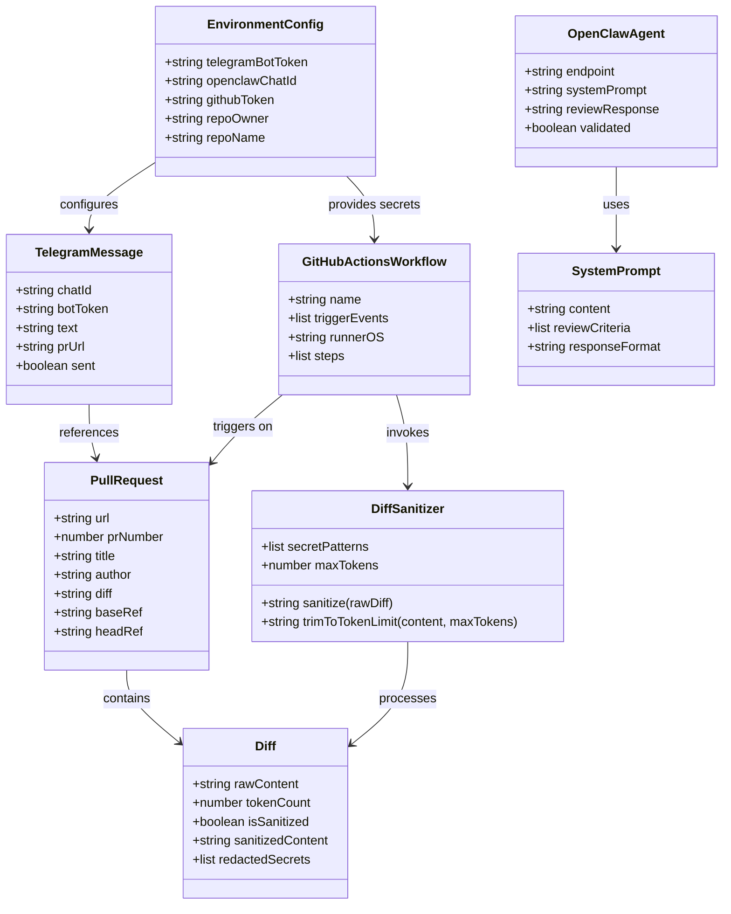

# AI PR Reviewer

## Requirements
Implement an automated AI-powered PR review system that fetches GitHub PR diffs via GitHub Actions, sanitizes untrusted input, and triggers an OpenClaw LLM agent via Telegram Bot API to perform code reviews and return structured feedback to users.

## Entities



## Approach

1. **Event-Driven Architecture**:
   - GitHub PR events (opened, reopened, synchronize) trigger GitHub Actions workflow
   - Workflow orchestrates diff fetching, sanitization, and Telegram notification
   - OpenClaw agent asynchronously processes review and responds via Telegram

2. **Technical Implementation**:
   - Use Node.js (CommonJS) with `@octokit/rest` for GitHub API access
   - Implement `dotenv` for environment variable management
   - Use Telegram Bot API (`https://api.telegram.org/bot<TOKEN>/sendMessage`) for OpenClaw integration
   - Store workflow in `.github/workflows/pr-review.yml`

3. **Security and Validation**:
   - Regex-based secret redaction in diff (API keys, tokens, passwords, private keys)
   - Token limit enforcement (trim diff to ~8000 tokens)
   - LLM output validation via JSON schema verification
   - Fail-safe error handling with informative messages

4. **Global Exception Handling Strategy**:
   - Node.js error-first callbacks and async/await with try-catch
   - Centralized error logging to console.error with context
   - Process exit on critical failures in GitHub Actions (non-zero exit code)
   - Telegram notification on workflow failures (optional enhancement)

## Structure

### Inheritance Relationships
1. `BaseError` class extends `Error` for custom error types
2. `DiffSanitizationError` extends `BaseError`
3. `TelegramSendError` extends `BaseError`
4. `GitHubAPIError` extends `BaseError`

### Dependencies
1. `get-diff.js` calls `@octokit/rest` (Octokit)
2. `notify-claw.js` calls `node-fetch` or `https` module (Telegram API)
3. GitHub Actions workflow depends on both scripts
4. `get-diff.js` depends on `dotenv` for configuration
5. `prompts/pr-reviewer.md` is read by OpenClaw agent (external dependency)

### Layered Architecture
1. **Script Layer**: `get-diff.js` and `notify-claw.js` - entry points for GitHub Actions
2. **Processing Layer**: Diff sanitization logic, token counting, message formatting
3. **Integration Layer**: GitHub API (Octokit), Telegram Bot API
4. **Configuration Layer**: Environment variables (`.env`), workflow secrets
5. **Error Handling Layer**: Custom error classes, try-catch blocks, process exit codes

## Operations

### Create Error Handler - Custom Error Classes
1. Responsibility: Define custom error types for consistent error handling
2. Classes:
   - `BaseError` extends `Error`:
     - Attributes: `code` (string), `message` (string), `details` (any)
     - Constructor: `BaseError(code, message, details)`
   - `DiffSanitizationError` extends `BaseError`:
     - Code: `DIFF_SANITIZATION_FAILED`
   - `TelegramSendError` extends `BaseError`:
     - Code: `TELEGRAM_SEND_FAILED`
   - `GitHubAPIError` extends `BaseError`:
     - Code: `GITHUB_API_FAILED`
3. Methods: None (constructor only)
4. Annotations: None
5. Constraints: Must provide meaningful error messages; must not expose secrets in details

### Create Script - get-diff.js
1. Responsibility: Fetch PR diff from GitHub and output sanitized version
2. Attributes:
   - `octokit`: Octokit instance - GitHub API client
   - `prUrl`: string - PR URL from environment or input
   - `maxTokens`: number - token limit (default 8000)
3. Methods:
   - `fetchDiff(prUrl)`: string
     - Logic:
       - Parse PR URL to extract owner, repo, PR number
       - Call `octokit.pulls.get` with media type `application/vnd.github.v3.diff`
       - Return raw diff string
       - Error handling: throw GitHubAPIError on failure
   - `sanitizeDiff(diff)`: string
     - Logic:
       - Apply regex patterns to redact secrets (API keys, tokens, passwords)
       - Replace matched patterns with `[REDACTED]`
       - Log redaction count to console
       - Error handling: throw DiffSanitizationError on failure
   - `trimToTokenLimit(diff, maxTokens)`: string
     - Logic:
       - Estimate tokens (characters / 4 as approximation)
       - If under limit, return as-is
       - If over limit, truncate with `... [truncated]` suffix
       - Preserve diff headers (---, +++) for context
   - `main()`: void
     - Logic:
       - Load env vars from `.env` (dotenv)
       - Get PR URL from `process.env.PR_URL` or command line args
       - Call fetchDiff, sanitizeDiff, trimToTokenLimit
       - Output sanitized diff to stdout (for GitHub Actions)
       - Catch errors and exit with code 1
4. Annotations: None (CommonJS, not TypeScript)
5. Constraints: Must not log raw diff (security); must handle empty diffs gracefully

### Create Script - notify-claw.js
1. Responsibility: Send Telegram message to OpenClaw bot with PR URL
2. Attributes:
   - `botToken`: string - Telegram bot token from env
   - `chatId`: string - OpenClaw chat ID from env
   - `prUrl`: string - PR URL to send
   - `message`: string - formatted message
3. Methods:
   - `formatMessage(prUrl)`: string
     - Logic:
       - Create message: `🔍 New PR Review Request\n\nPR: ${prUrl}\n\nPlease review this PR and provide structured feedback.`
       - Include instructions for OpenClaw agent
       - Return formatted string
   - `sendTelegramMessage(message)`: Promise<void>
     - Logic:
       - Construct URL: `https://api.telegram.org/bot${botToken}/sendMessage`
       - Make POST request with JSON body: `{ chat_id: chatId, text: message }`
       - Use Node.js built-in `https` module (Node 18+ compatible)
       - Parse response, check `ok` field
       - Error handling: throw TelegramSendError on failure
   - `main()`: void
     - Logic:
       - Load env vars
       - Get PR URL from stdin (piped from get-diff.js) or env
       - Call formatMessage, sendTelegramMessage
       - Log success message
       - Catch errors, exit with code 1
4. Annotations: None (CommonJS)
5. Constraints: Message length must respect Telegram limits (4096 chars); must not include raw diff in message (only URL)

### Create GitHub Actions Workflow - .github/workflows/pr-review.yml
1. Responsibility: Orchestrate PR review on pull_request events
2. Configuration:
   - Name: `AI PR Reviewer`
   - Trigger: `pull_request` types: `[opened, reopened, synchronize]`
   - Concurrency group: `pr-review-${{ github.event.pull_request.number }}`
   - Jobs:
     - `review`:
       - Runs-on: `ubuntu-latest`
       - Steps:
         1. Checkout repo (optional, for context)
         2. Setup Node.js (v18)
         3. Install dependencies: `npm install @octokit/rest dotenv`
         4. Fetch and sanitize diff:
            - Run: `node get-diff.js`
            - Env: `GITHUB_TOKEN`, `PR_URL` (from `github.event.pull_request.html_url`)
            - Output diff to file or variable
         5. Notify OpenClaw:
            - Run: `node notify-claw.js`
            - Env: `TELEGRAM_BOT_TOKEN`, `OPENCLAW_CHAT_ID`, `PR_URL`
            - Input: PR URL (or piped diff summary)
         6. Error handling: If any step fails, log error and exit
3. Methods: None (YAML configuration)
4. Annotations: None
5. Constraints: Must not log secrets; must use GitHub's `GITHUB_TOKEN` for API access

### Create System Prompt - prompts/pr-reviewer.md
1. Responsibility: Define OpenClaw agent behavior for PR reviews
2. Content:
   - Role: "You are an expert code reviewer analyzing GitHub PR diffs."
   - Instructions:
     - Fetch PR details from URL (provided in message)
     - Review code for: security vulnerabilities, code quality, best practices, potential bugs
     - Provide structured feedback in JSON format: `{ "overall": "pass|warning|fail", "comments": [{ "file": "path", "line": number, "comment": "text" }], "summary": "text" }`
   - Constraints: "Do not expose secrets; validate all inputs; be constructive."
3. Methods: None (markdown file)
4. Annotations: None
5. Constraints: Must be readable by OpenClaw agent; must define clear output format

### Create Configuration - .env.example
1. Responsibility: Document required environment variables
2. Content:
   ```
   TELEGRAM_BOT_TOKEN=your_telegram_bot_token_here
   OPENCLAW_CHAT_ID=your_openclaw_chat_id_here
   GITHUB_TOKEN=provided_by_github_actions
   REPO_OWNER=repository_owner
   REPO_NAME=repository_name
   MAX_TOKENS=8000
   ```
3. Methods: None
4. Annotations: None
5. Constraints: Must not contain real secrets; must match variable names used in scripts

## Norms

1. **Module Standards**: Use CommonJS (`require`/`module.exports`), not ES modules. File extensions: `.js`.

2. **Dependency Injection**: Pass dependencies via function parameters (e.g., `octokit` instance) rather than global singletons. For scripts, instantiate at top of file.

3. **Exception Handling**:
   - Use async/await with try-catch for asynchronous operations
   - Use error-first callbacks pattern where appropriate (Node.js convention)
   - Custom error classes must extend `BaseError`
   - All errors must be logged with `console.error` including context
   - Scripts must exit with non-zero code on failure (`process.exit(1)`)
   - GitHub Actions workflow must fail step on non-zero exit

4. **Data Validation**:
   - Validate environment variables exist before use (throw error if missing)
   - Validate PR URL format before parsing
   - Validate Telegram response `ok` field before proceeding
   - Use simple regex or manual checks (no heavy validation libraries needed)

5. **Logging**:
   - Use `console.log` for informational messages (with emojis for readability: ✅, ❌, 🔍)
   - Use `console.error` for errors (with stack traces)
   - Do not log sensitive data (tokens, diffs, secrets)
   - Log key steps: "Fetching diff...", "Diff sanitized (3 secrets redacted)", "Message sent to Telegram"

6. **Documentation Standards**:
   - Add JSDoc comments for functions: `@param {Type} name - description`, `@returns {Type}`
   - Add inline comments for complex regex or logic
   - README not required for scripts (covered by workflow)

## Safeguards

1. **Functional Constraints**:
   - Must only trigger on PR events of types: opened, reopened, synchronize
   - Must not process PRs with empty diffs (skip silently or log warning)
   - Must not send full diff in Telegram message (only URL)
   - Must validate OpenClaw response structure before trusting

2. **Performance Constraints**:
   - Diff token count must not exceed `MAX_TOKENS` (default 8000)
   - Telegram message length must not exceed 4096 characters
   - GitHub API calls must complete within workflow timeout (3600 seconds)
   - Script execution must complete within 5 minutes per PR

3. **Security Constraints**:
   - All diffs must be sanitized before sending to external services
   - Secret redaction patterns must cover: API keys (AKIA...), tokens (ghp_..., glpat...), passwords, private keys
   - Environment variables must be loaded from `process.env`, never hardcoded
   - GitHub token must only be used for reading PR data, not modifying
   - Telegram bot token must be treated as secret (not logged)

4. **Integration Constraints**:
   - Must use GitHub Actions `GITHUB_TOKEN` (provided automatically)
   - Must use Telegram Bot API v6+ endpoint format
   - Must assume OpenClaw agent is pre-configured and running
   - Must handle Telegram API rate limits (429 responses) with retry (optional)

5. **Business Rule Constraints**:
   - Diff sanitization must preserve diff structure (---, +++ headers)
   - Token trimming must not cut in middle of diff hunk headers
   - OpenClaw agent must return JSON with `overall`, `comments`, `summary` fields
   - On validation failure, must report error and not proceed

6. **Exception Handling Constraints**:
   - Custom errors must include error code and message
   - Error messages must not expose internal paths or stack traces to external services
   - All external API calls (GitHub, Telegram) must have error handling
   - Workflow must fail explicitly on script errors (exit code 1)

7. **Technical Constraints**:
   - Node.js version: 18+ (for fetch API support if using node-fetch)
   - Must use `@octokit/rest` v19+ for GitHub API
   - Must use `dotenv` v16+ for configuration
   - Must not require external databases or persistent storage

8. **Data Constraints**:
   - PR URL must be valid GitHub URL format
   - Diff content must be string (utf-8)
   - Telegram chat ID must be numeric string or @channel_name
   - Environment variables must be non-empty strings

9. **API Constraints**:
   - GitHub API: Use `application/vnd.github.v3.diff` media type for diff
   - Telegram API: Use JSON payload in POST request body
   - OpenClaw: Expect text message with PR URL; response format defined in system prompt