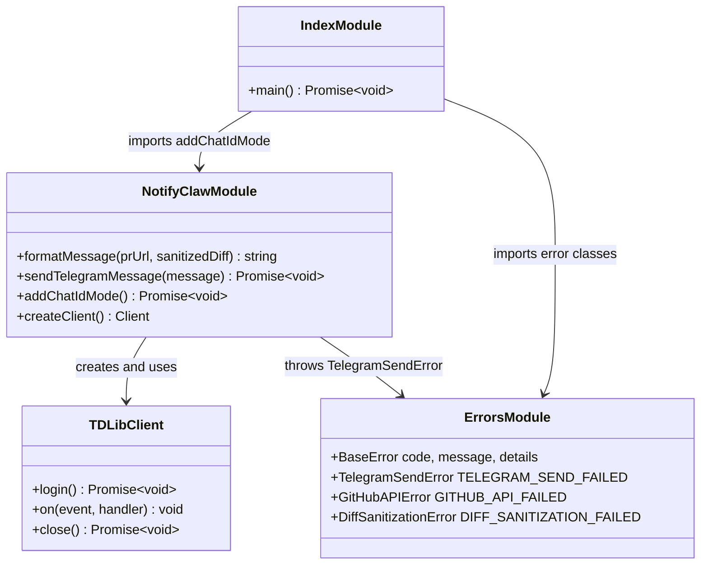

# Add `--addChatId` CLI Option

## Requirements

Add a `--addChatId` CLI option to the AI PR Reviewer tool that allows the user to manually capture a Telegram chat ID. When `node index.js --addChatId` is run, the app connects to Telegram via the existing TDLib setup, listens for an incoming message, extracts the chat ID, and displays it to the user.

### Acceptance Criteria

| AC# | Description |
|-----|-------------|
| AC-1 | `--addChatId` flag is recognized from `process.argv` |
| AC-2 | App connects to Telegram using existing tdl/TDLib setup |
| AC-3 | App listens for incoming messages via TDLib's update mechanism |
| AC-4 | `chat_id` is extracted from the incoming message update |
| AC-5 | "Waiting for message..." is displayed after connection |
| AC-6 | Captured chat ID is displayed to the user |
| AC-7 | Ctrl+C cancels cleanly without corrupting TDLib state |
| AC-8 | Optional timeout if no message is received |

### Constraints

- **No new dependencies**: Reuse existing `tdl` library
- **Files to modify**: Only `index.js` and `notify-claw.js`
- **Preserve existing behavior**: Normal PR review flow must be unchanged when flag is absent

---

## Entities



### Existing Entities

#### `notify-claw.js` — Telegram Notification Module

| Aspect | Current State |
|--------|---------------|
| **Exports** | `formatMessage`, `sendTelegramMessage` |
| **TDLib Client Creation** | Inline within `sendTelegramMessage()`: `tdl.createClient({ apiId, apiHash, databaseDirectory, filesDirectory, tdlibParameters })` |
| **Login** | `await client.login()` |
| **Error Handling** | Uses `TelegramSendError` from `errors.js`, catches `tdl.TdlError` |
| **Cleanup** | `finally` block with `await client.close()` |
| **TDLib Config** | `tdl.configure({ tdjson: getTdjson() })` using `prebuilt-tdlib` |

#### `index.js` — CLI Entry Point

| Aspect | Current State |
|--------|---------------|
| **Argument Handling** | Single positional arg: `process.argv[2]` as PR URL |
| **Env Validation** | Checks `GITHUB_TOKEN`, `TELEGRAM_API_ID`, `TELEGRAM_API_HASH`, `OPENCLAW_CHAT_ID` |
| **Flow** | Validate env → get PR URL → fetch diff → format message → send notification |
| **Error Handling** | Typed errors from `errors.js` with `instanceof` checks |

#### `errors.js` — Error Classes

| Class | Code | Usage |
|-------|------|-------|
| `BaseError` | — | Base class with `code`, `message`, `details` |
| `TelegramSendError` | `TELEGRAM_SEND_FAILED` | Telegram operation failures |
| `GitHubAPIError` | `GITHUB_API_FAILED` | GitHub API failures |
| `DiffSanitizationError` | `DIFF_SANITIZATION_FAILED` | Diff sanitization failures |

### New Entity

#### `addChatIdMode()` — Chat ID Capture Function (in `notify-claw.js`)

| Aspect | Design |
|--------|--------|
| **Purpose** | Connect to Telegram, listen for message, extract and display chat ID |
| **Input** | None (reads from TDLib updates) |
| **Output** | Console output displaying the captured chat ID |
| **TDLib Client** | Reuse same `tdl.createClient()` config as `sendTelegramMessage()` |
| **Update Handling** | Listen for `updateNewMessage` events via `client.on('update', ...)` |
| **Chat ID Extraction** | Read `update.message.chat_id` from TDLib update object |

---

## Approach

1. **CLI Mode Branching**: Detect `--addChatId` in `process.argv` at the top of `main()` in `index.js`. When flag is present, delegate to `addChatIdMode()` and exit — bypasses normal PR review flow entirely. No risk of side effects to existing flow.

2. **TDLib Client Reuse**: Extract the TDLib client creation logic from `sendTelegramMessage()` into a shared `createClient()` function in `notify-claw.js`. Both `sendTelegramMessage` and `addChatIdMode` use the same client configuration. Avoids duplication of client setup code.

3. **Message Listening**: After login, register `client.on('update', handler)` to listen for TDLib updates. On first `updateNewMessage`, extract `chat_id`, display it, close client, and exit. Set a 60-second timeout to prevent indefinite waiting.

4. **Graceful Shutdown**: Ctrl+C handler (`process.on('SIGINT', ...)`) closes TDLib client and exits cleanly. `finally` block ensures `client.close()` is called on all exit paths. Timeout cleanup also closes client before exiting.

---

## Structure

### Inheritance Relationships

1. `BaseError` extends `Error` — base class for all custom errors
2. `TelegramSendError` extends `BaseError` — Telegram operation failures
3. `GitHubAPIError` extends `BaseError` — GitHub API failures
4. `DiffSanitizationError` extends `BaseError` — Diff sanitization failures

### Dependencies

1. `index.js` imports `addChatIdMode` from `notify-claw.js`
2. `index.js` imports error classes from `errors.js`
3. `notify-claw.js` imports `tdl` and `prebuilt-tdlib` for TDLib client
4. `notify-claw.js` imports `TelegramSendError` from `errors.js`
5. `addChatIdMode()` depends on shared `createClient()` function in `notify-claw.js`

### Layered Architecture

1. **CLI Layer** (`index.js`): Parses `process.argv`, detects `--addChatId` flag, delegates to appropriate mode
2. **Telegram Layer** (`notify-claw.js`): Contains all Telegram/TDLib logic — both notification sending and chat ID capture
3. **Error Layer** (`errors.js`): Custom error classes for typed error handling across all modules

---

## Operations

### Step 1: Extract Shared TDLib Client Creation in `notify-claw.js`

**File**: `notify-claw.js`

Extract the TDLib client creation logic from `sendTelegramMessage()` into a shared `createClient()` function:

```javascript
function createClient() {
  tdl.configure({ tdjson: getTdjson() });

  const client = tdl.createClient({
    apiId: parseInt(process.env.TELEGRAM_API_ID, 10),
    apiHash: process.env.TELEGRAM_API_HASH,
    databaseDirectory: process.env.TDL_DATABASE_DIR || '_td_database',
    filesDirectory: process.env.TDL_FILES_DIR || '_td_files',
    tdlibParameters: {
      use_message_database: true,
      use_secret_chats: true,
      system_language_code: 'en',
      application_version: '1.0',
      device_model: 'Unknown device',
      system_version: 'Unknown',
      enable_storage_optimizer: true
    }
  });

  client.on('error', (err) => {
    console.error('TDLib client error:', err);
  });

  return client;
}
```

Update `sendTelegramMessage()` to call `createClient()` instead of inline creation.

Export `createClient` alongside existing exports.

**Rationale**: Both `sendTelegramMessage` and the new `addChatIdMode` need identical TDLib client setup. Extracting avoids duplication.

---

### Step 2: Implement `addChatIdMode()` in `notify-claw.js`

**File**: `notify-claw.js`

Add the `addChatIdMode()` function:

**Signature**: `async function addChatIdMode()`

**Behavior**:

1. **Create and connect TDLib client**: Use the shared `createClient()` function. Call `await client.login()`.

2. **Display waiting message**: `console.log('Waiting for message...')`.

3. **Set up timeout**: Start a 60-second `setTimeout`. If it fires before a message is received, log a warning, close the client, and exit.

4. **Listen for incoming messages**: Register `client.on('update', (update) => { ... })`. On first `updateNewMessage` update:
   - Clear the timeout
   - Extract `chat_id` from `update.message.chat_id`
   - Display: `console.log('Chat ID captured: <id>')`
   - Stop listening for further updates

5. **Cleanup**: In `finally` block, close TDLib client with `await client.close()`.

6. **Handle Ctrl+C**: Register `process.on('SIGINT', ...)` to close client and exit cleanly. Remove listener after normal completion.

**Error Handling**:
- TDLib errors → `TelegramSendError`

**Export**: Add `addChatIdMode` to the module's export list.

---

### Step 3: Add CLI Flag Detection in `index.js`

**File**: `index.js`

Modify the entry point to detect `--addChatId`:

1. **Import**: Add `addChatIdMode` to the import from `notify-claw.js`.

2. **Flag detection**: At the top of `main()`, before env validation:
   ```javascript
   if (process.argv.includes('--addChatId')) {
     await addChatIdMode();
     process.exit(0);
   }
   ```

3. **No other changes**: The rest of `main()` (env validation, PR review flow) remains unchanged.

**Rationale**: Early return keeps the new mode completely separate from the existing flow. No risk of side effects.

---

## Norms

### Coding Conventions (from existing codebase)

| Convention | Standard |
|------------|----------|
| **Module system** | ESM (`import`/`export`, `"type": "module"` in package.json) |
| **Error handling** | Custom error classes from `errors.js` with `code`, `message`, `details` |
| **Console output** | Emoji-prefixed messages (`✅`, `❌`, `⚠️`, `📤`, `🔍`) |
| **JSDoc** | All functions have JSDoc comments with `@param`, `@returns`, `@module` |
| **File naming** | camelCase for JS files |
| **Env access** | Via `process.env`, validated at function start |
| **Cleanup** | `try/finally` for resource cleanup (see `sendTelegramMessage` pattern) |

### New Conventions Introduced

| Convention | Standard |
|------------|----------|
| **Timeout handling** | `setTimeout` with cleanup in `finally`; clear on success path |
| **Signal handling** | `process.on('SIGINT', ...)` for graceful Ctrl+C; remove listener after completion |

---

## Safeguards

### Error Scenarios

| Scenario | Handling | Error Type |
|----------|----------|------------|
| TDLib login fails | Throw with TDLib error details | `TelegramSendError` |
| No message received (timeout) | Log warning, close client, exit | Console warning |
| Ctrl+C during listen | Close client, exit cleanly | Clean exit |

### Edge Case Handling

| Edge Case | Behavior |
|-----------|----------|
| Multiple messages received | Use first message only; ignore subsequent |
| TDLib not authenticated | Wait for auth state; timeout if auth never completes |

### Verification Steps

1. **Normal flow unchanged**: Run `node index.js <PR_URL>` — should work exactly as before
2. **Flag detection**: Run `node index.js --addChatId` — should enter chat ID capture mode
3. **Chat ID capture**: Send a message in Telegram while in capture mode — should display chat ID
4. **Ctrl+C handling**: Press Ctrl+C during listen — should exit cleanly
5. **Timeout**: Wait 60 seconds without sending a message — should display timeout message and exit